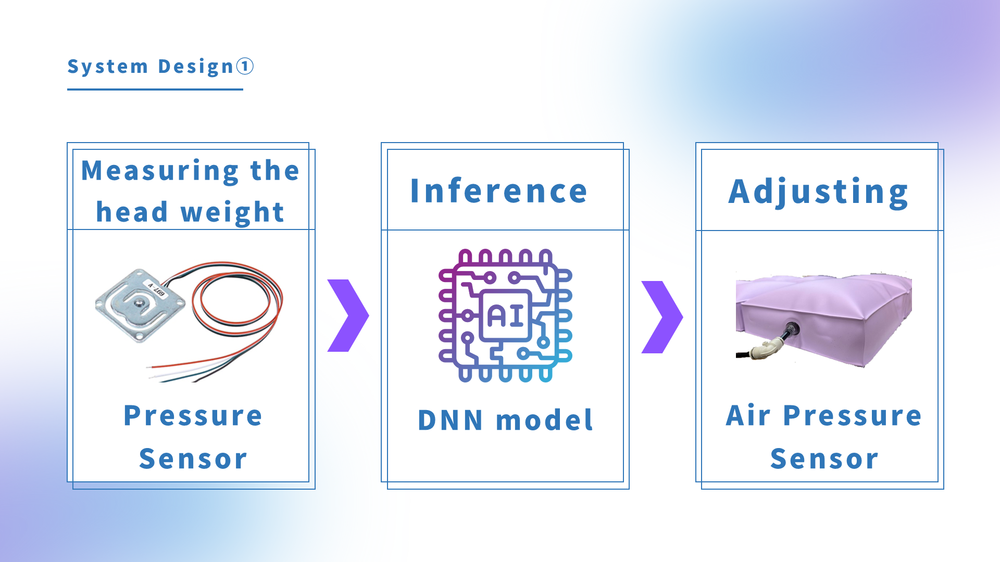
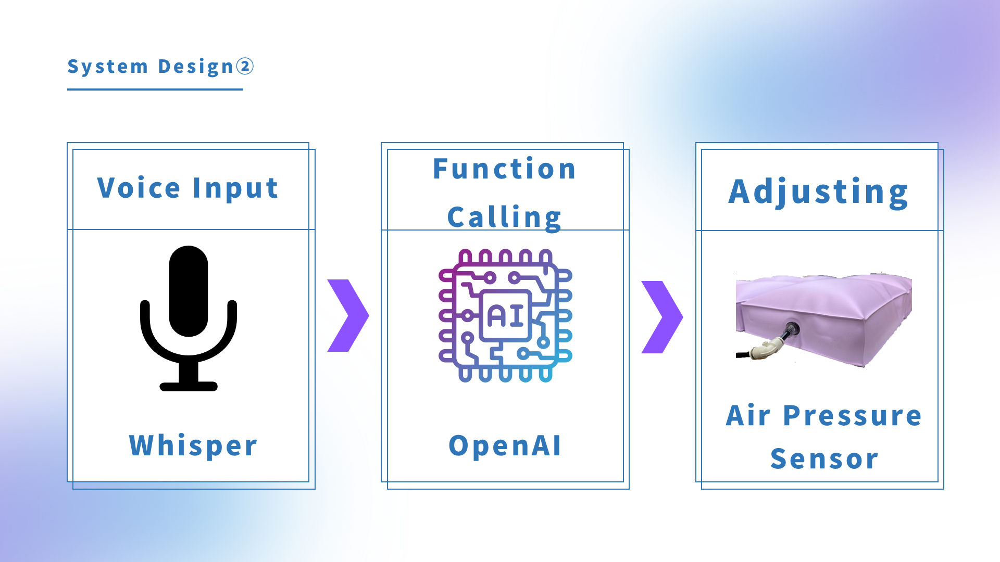

# FAIP (Future Artificial Intelligence Pillow)

<div id="top"></div>


<a href="https://github.com/SKouga0926/FAIP/blob/main/README.md" target="_blank" rel="noopener noreferrer">Click here for the Japanese version README</a>

## Table of Contents

1. [Overview](#overview)
2. [Technologies Used](#technologies-used)
3. [System Design](#system-design)
4. [Environment](#environment)
5. [Directory Structure](#directory-structure)
6. [Setting Up the Development Environment](#setting-up-the-development-environment)
7. [Developer](#developer)

## Overview

This project is related to the AI pillow we proposed for the [5th National Technical College Deep Learning Contest 2024 (DCON2024)](https://dcon.ai/about/). It is a business contest where teams create projects using "manufacturing technologies" and "deep learning" and compete for business value, represented by their company evaluation.

## Technologies Used

</img>
</img>
</img>
</img>
</img>

## System Design

### System Design①

The system design is as follows:

Pressure data collected by Arduino is used as input. The AI uses this data to infer the amount of air pressure inside the pillow's airbag, and a small pump inflates the pillow to the required height.



### System Design②

Voice input is also used to adjust the pillow's height. Using OpenAI's Whisper, the user's voice is converted to text, and this text is analyzed to determine the appropriate value for adjusting the pillow's height using OpenAI's API.



<p align="right">(<a href="#top">Back to Top</a>)</p>

## Environment

The OS and microcontroller used are Windows 11 and Arduino Nano Every, respectively. The programming languages and frameworks used are as follows:

For more details on Python packages, please refer to the [requirements.txt](https://github.com/SKouga0926/FAIP/blob/main/main/Python/requirements/requirements.txt).

| OS & Microcontroller     | Version |
|--------------------------|---------|
| Windows                  | 11      |
| Arduino Nano Every       |         |

| Language & Framework     | Version |
|--------------------------|---------|
| Python                   | 3.11.9  |
| TensorFlow               | 2.16.1  |
| Pandas                   | 2.2.1   |
| Keras                    | 3.1.1   |
| NumPy                    | 1.26.4  |

<p align="right">(<a href="#top">Back to Top</a>)</p>

## Directory Structure

The directory structure for this project is as follows:

`````
.
├── README-eng.md                                                   # English version of the project overview
├── README.md                                                       # Japanese version of the project overview
├── image                                                           # Images related to the project
│   ├── greet.jpg                                                   # Greeting screen image
│   └── system1.jpg                                                 # System architecture diagram 1 image
│   └── system2.jpg                                                 # System architecture diagram 2 image
└── main                                                            # Main project code
    ├── Arduino                                                     # Arduino related code
    │   ├── calcHeadcordinate                                       # Code to calculate head coordinates
    │   │   ├── calcHeadcordinate.ino                               # Main script
    │   │   └── calcHeadcordinate2.ino                              # Alternative script
    │   ├── datacollect                                             # Data collection code
    │   │   ├── air_sensor.cpp                                      # Air sensor implementation
    │   │   ├── air_sensor.hpp                                      # Header file for air sensor
    │   │   ├── airpump.cpp                                         # Air pump control implementation
    │   │   ├── airpump.hpp                                         # Header file for air pump control
    │   │   ├── bluetooth_server.cpp                                # Bluetooth server implementation
    │   │   ├── bluetooth_server.hpp                                # Header file for Bluetooth server
    │   │   ├── communication_status_manager.cpp                    # Communication status management
    │   │   ├── communication_status_manager.hpp                    # Header file for communication status management
    │   │   ├── datacollect.ino                                     # Main script for data collection
    │   │   ├── loadcell.cpp                                        # Load cell control implementation
    │   │   ├── loadcell.hpp                                        # Header file for load cell
    │   │   ├── pin_definition.hpp                                  # Pin definition
    │   │   ├── solenoid_valve.cpp                                  # Solenoid valve control implementation
    │   │   ├── solenoid_valve.hpp                                  # Header file for solenoid valve control
    │   │   ├── space_separated_parser.cpp                          # Space-separated parser
    │   │   └── space_separated_parser.hpp                          # Header file for space-separated parser
    │   └── main                                                    # Arduino main code
    │       ├── main.ino                                            # Main script
    │       ├── pid_controller.cpp                                  # PID controller implementation
    │       ├── pid_controller.hpp                                  # Header file for PID controller
    │       └── (other files are duplicates from datacollect)
    └── Python                                                      # Python related code
        ├── .env                                                    # Virtual environment
        ├── data                                                    # Data-related
        │   ├── processed                                           # Processed data
        │   │   ├── dnn_air_pressure_model/sensor_data.csv          # Sensor data for air pressure model
        │   │   └── dnn_sleep_position_model/sensor_data.csv        # Data for sleep position model
        │   └── raw                                                 # Raw data
        │       ├── dnn_air_pressure_model/sensor_data.csv          # Raw data for air pressure model
        │       ├── dnn_sleep_position_model/sensor_data.csv        # Raw data for sleep position model
        │       └── sensor_data.csv                                 # Raw sensor data
        ├── model                                                   # Model storage directory
        │   ├── dnn_air_pressure_model/pressure_model_widgets.h5    # Weights for air pressure model
        │   └── dnn_sleep_position_model/pressure_model_widgets.h5  # Weights for sleep position model
        ├── photo                                                   # Photo data (empty)
        ├── requirement                                             # Required libraries
        │   └── requirements.txt                                    # Required Python packages
        └── src                                                     # Source code
            ├── data/collect_data.py                                # Data collection script
            ├── features                                            # Feature engineering related
            │   ├── dnn_air_pressure_model/(processing scripts)
            │   └── dnn_sleep_position_model/(processing scripts)
            ├── main.py                                             # Main script
            ├── pkg                                                 # Python packages
            │   ├── bluetooth_server.py                             # Bluetooth server
            │   ├── dnn_air_pressure_model.py                       # Air pressure model
            │   ├── dnn_sleep_position_model.py                     # Sleep position model
            │   └── space_separated_parser.py                       # Parser
            ├── response.json                                       # Response data
            └── test                                                # Test code
                ├── (details omitted)
`````

<p align="right">(<a href="#top">Back to top</a>)</p>

## Setting Up the Development Environment

### Arduino Side

#### Writing and Execution

Write the code in `./Arduino/main/main.ino` to the Arduino and run it.

### Python Side

#### Creating and Activating the Virtual Environment

Create a virtual environment with the following command:

```python -m venv <virtual_environment_name>```

#### Installing Libraries

You can install the libraries in the virtual environment with the following command:

```pip install -r requirements/requirements.txt```

#### Execution

You can run the program with the following command:

```python main.py```

or

```python3 main.py```

<p align="right">(<a href="#top">Back to top</a>)</p>

## Developer

Connect with me !! 😊

[](https://x.com/sugarkouga926)

<p align="right">(<a href="#top">Back to top</a>)</p>
