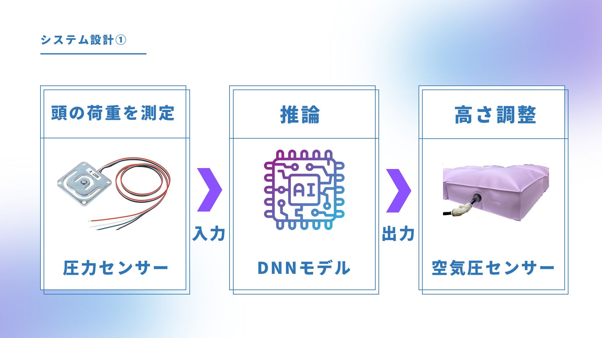
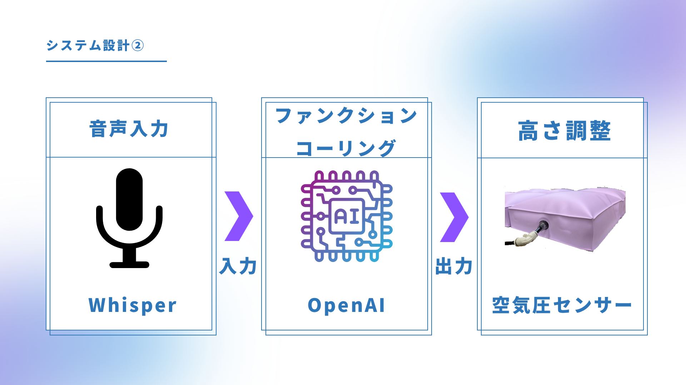

# FAIP (Future Artificial Intelligence Pillow)

<div id="top"></div>


<a href="https://github.com/SKouga0926/FAIP/blob/main/README-eng.md" target="_blank" rel="noopener noreferrer">英語版 README はこちらです</a>

## 目次

1. [概要](#概要)
2. [使用技術一覧](#使用技術一覧)
3. [システム設計について](#システム設計について)
4. [環境](#環境)
5. [ディレクトリ構成](#ディレクトリ構成)
6. [開発環境構築](#開発環境構築)
7. [開発者](#開発者)

## 概要

本プロジェクトは、「ものづくりの技術」と「ディープラーニング」を活用した作品を制作し、その作品から生み出される「事業性」を企業評価額で競うビジネスコンテストである[第５回全国高等専門学校ディープラーニングコンテスト2024（DCON2024）](https://dcon.ai/about/)において、私たちが提案したAI枕に関するプロジェクトである。

## 使用技術一覧

</img>
</img>
</img>
</img>
</img>

## システム設計について

### システム設計①

システム設計については、下記の通りになります。

Arduinoで取得した圧力データを入力データとして活用します。
入力データからAIが枕の空気袋内の空気圧量を推論し、その空気圧量まで小型ポンプを用いて膨らませることで、最終的に枕の高さ調整を実現しております。



### システム設計②

音声入力による枕の高さ調整も、下記のシステム設計により可能としています。具体的には、OpenAIのWhisperを使用することで、ユーザーの音声をテキストに変換し、そのテキストを分析して枕の高さを調整するための適切な数値をOpenAIのAPIで算出します。



<p align="right">(<a href="#top">トップへ</a>)</p>

## 環境

使用したOS・マイコンは下記の通りWindows 11、Arduino Nano Everyです。言語・フレームワークは下記の通りです。

その他Pythonパッケージについては、<a href="https://github.com/SKouga0926/FAIP/blob/main/main/Python/requirements/requirements.txt" target="_blank" rel="noopener noreferrer">requirements.txt</a>をご参照ください。

| OS・マイコン  | バージョン |
| --------------------- | ---------- |
| Windows               | 11         |
| Arduino Nano Every    |            |

| 言語・フレームワーク  | バージョン |
| --------------------- | ---------- |
| Python                | 3.11.9     |
| tensorflow            | 2.16.1     |
| pandas                | 2.2.1      |
| keras                 | 3.1.1      |
| numpy                 | 1.26.4     |

<p align="right">(<a href="#top">トップへ</a>)</p>

## ディレクトリ構成

本プロジェクトのディレクトリ構成は下記の通りです。

`````
.
├── README-eng.md                                                   # 英語版のプロジェクト概要
├── README.md                                                       # 日本語版のプロジェクト概要
├── image                                                           # プロジェクト関連の画像ファイル
│   ├── greet.jpg                                                   # 挨拶画面の画像
│   └── system1.jpg                                                 # システム構成図1の画像
│   └── system2.jpg                                                 # システム構成図2の画像
└── main                                                            # メインのプロジェクトコード
    ├── Arduino                                                     # Arduino 関連コード
    │   ├── calcHeadcordinate                                       # 頭の座標を計算するコード
    │   │   ├── calcHeadcordinate.ino                               # メインスクリプト
    │   │   └── calcHeadcordinate2.ino                              # 代替スクリプト
    │   ├── datacollect                                             # データ収集用コード
    │   │   ├── air_sensor.cpp                                      # エアセンサーの実装
    │   │   ├── air_sensor.hpp                                      # エアセンサーのヘッダファイル
    │   │   ├── airpump.cpp                                         # エアポンプ制御の実装
    │   │   ├── airpump.hpp                                         # エアポンプ制御のヘッダファイル
    │   │   ├── bluetooth_server.cpp                                # Bluetoothサーバーの実装
    │   │   ├── bluetooth_server.hpp                                # Bluetoothサーバーのヘッダファイル
    │   │   ├── communication_status_manager.cpp                    # 通信状態管理
    │   │   ├── communication_status_manager.hpp                    # 通信状態管理のヘッダ
    │   │   ├── datacollect.ino                                     # データ収集のメインスクリプト
    │   │   ├── loadcell.cpp                                        # ロードセルの制御実装
    │   │   ├── loadcell.hpp                                        # ロードセルのヘッダファイル
    │   │   ├── pin_definition.hpp                                  # ピン定義
    │   │   ├── solenoid_valve.cpp                                  # ソレノイドバルブの制御
    │   │   ├── solenoid_valve.hpp                                  # ソレノイドバルブのヘッダファイル
    │   │   ├── space_separated_parser.cpp                          # スペース区切りパーサ
    │   │   └── space_separated_parser.hpp                          # スペース区切りパーサのヘッダ
    │   └── main                                                    # Arduino メインコード
    │       ├── main.ino                                            # メインスクリプト
    │       ├── pid_controller.cpp                                  # PIDコントローラーの実装
    │       ├── pid_controller.hpp                                  # PIDコントローラーのヘッダファイル
    │       └── （他のファイルは datacollect と重複）
    └── Python                                                      # Python 関連コード
        ├── .env                                                    # 仮想環境
        ├── data                                                    # データ関連
        │   ├── processed                                           # 処理済みデータ
        │   │   ├── dnn_air_pressure_model/sensor_data.csv          # 空気圧モデル用のセンサーデータ
        │   │   └── dnn_sleep_position_model/sensor_data.csv        # 寝姿勢推定モデルのデータ
        │   └── raw                                                 # 生データ
        │       ├── dnn_air_pressure_model/sensor_data.csv          # 空気圧モデル用の生データ
        │       ├── dnn_sleep_position_model/sensor_data.csv        # 寝姿勢推定モデルの生データ
        │       └── sensor_data.csv                                 # 生センサーデータ
        ├── model                                                   # モデル保存ディレクトリ
        │   ├── dnn_air_pressure_model/pressure_model_widgets.h5    # 空気圧モデルの重み
        │   └── dnn_sleep_position_model/pressure_model_widgets.h5  # 寝姿勢推定モデルの重み
        ├── photo                                                   # 写真データ（空）
        ├── requirement                                             # 必要ライブラリ情報
        │   └── requirements.txt                                    # 必要なPythonパッケージ
        └── src                                                     # ソースコード
            ├── data/collect_data.py                                # データ収集スクリプト
            ├── features                                            # 特徴量エンジニアリング関連
            │   ├── dnn_air_pressure_model/（処理スクリプト）
            │   └── dnn_sleep_position_model/（処理スクリプト）
            ├── main.py                                             # メインスクリプト
            ├── pkg                                                 # Python パッケージ
            │   ├── bluetooth_server.py                             # Bluetoothサーバー
            │   ├── dnn_air_pressure_model.py                       # 空気圧モデル
            │   ├── dnn_sleep_position_model.py                     # 寝姿勢推定モデル
            │   └── space_separated_parser.py                       # パーサ
            ├── response.json                                       # 応答データ
            └── test                                                # テストコード
                ├── （詳細省略）
`````

<p align="right">(<a href="#top">トップへ</a>)</p>

## 開発環境構築

### Arduino側

#### 書き込みと実行

./Arduino/main/main.inoをArduinoに書き込み、実行します。

### Python側

#### venv作成と起動

以下のコマンドで仮想環境を作成します。

```python -m venv 仮想環境名```

#### ライブラリのインストール

以下のコマンドで仮想環境内にライブラリをインストールできます。

```pip install -r requirements/requirements.txt```

#### 実行

以下のコマンドで実行します。

```python main.py```

または

```python3 main.py```

<p align="right">(<a href="#top">トップへ</a>)</p>

## 開発者

Connect with me !! 😊

[](https://x.com/sugarkouga926)

<p align="right">(<a href="#top">トップへ</a>)</p>